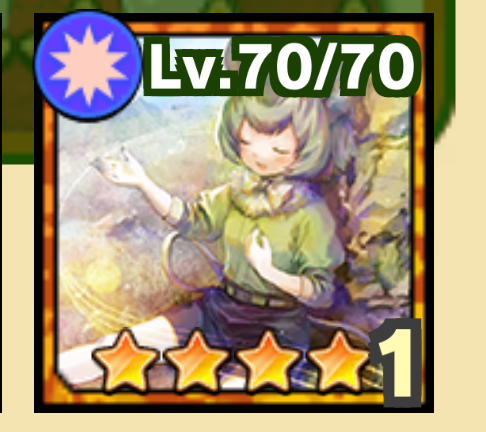
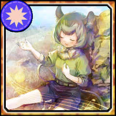

# KF3 Photo Icon Generator
[アプリ版けものフレンズ３wikiなのだ！](https://seesaawiki.jp/kemono_friends3_5ch/) で使用するフォトのアイコンを作成するツールです。 
フォト画像は「けものフレンズプロジェクト２Ｇ」及び「SEGA」「アピリッツ」又はその関連団体に帰属します。

## デモ
### 入力画像
&nbsp;&nbsp;&nbsp;&nbsp;

### 出力画像

## 使い方
1. [Releases](https://github.com/reamkf/KF3-Photo-Icon-Generator/releases)より`KF3-Photo-Icon-Generator.exe`をダウンロード
2. ダウンロードしたexeファイルを実行
3. 枠なしフォト画像とサンプルのアイコン画像を選択
   - exeファイルにドラッグ&ドロップして実行することも可能
4. 結果が`out.png`に出力される
